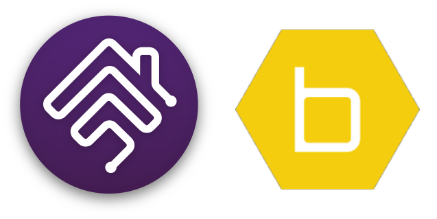

<p align="left">
 
</p>

# homebridge-platform-orbit
[](https://github.com/homebridge/homebridge/wiki/Verified-Plugins)
<br>Orbit B-Hyve Irrigation System platform plugin for [Homebridge](https://github.com/nfarina/homebridge).

## About

This plugin provides 3 options for use in HomeKit<br>Both option have additional switches as options for Standby/Off mode and a Run All across all devices along with any B-Hyve Program Schedules
1.	Irrigation System Accessory with zones that are linked (default in configuration)
2.	Irrigation System Accessory with separate zones shown as a single tile 
3.	Irrigation System Accessory with separate zones shown as a separate tiles (option in HomeKit)

<br> There are plus and minus to each, so why not have options.
<br> If you have more than one home on your B-Hyve account you may filter devices for a home based on the street address for the location you want to display in HomeKit. BLE devices such as Flood Sensors will follow the location of the Hub's address. (Did not work as expected). Addresses for flood sensors can be assigned [here](https://techsupport.orbitbhyve.com)
<br> If you have set manual preset runtimes for you controller or set zone flow rates in the B-Hyve app you can use these values for inital runtimes seen in HomeKit

## Notes on testing

This plugin has been tested or verified against hardware model/types
- Bridges BH1-0001 and BH1G2-0001 
- Hose Timers HT25-0000, HT31-0001, HT32-0001 and HT34-0001
- Flood Sensors FS1-0001

Other hardware models/types may still work with this plugin and any feedback on devices not listed is welcome.

## Installation
1. Install this plugin using: npm install -g homebridge-orbit-irrigation
2. Suggest running as a child bridge	
3. Use plugin settings to edit ``config.json`` and add your account detail.
4. Run Homebridge
5. Pair to HomeKit

## Config.json example with child bridge
```
"platforms": [
	{
		"name": "B-Hyve",
		"email": "username@mail.com",
		"password": "password",
		"locationAddress": "123 Easy St",
		"defaultRuntime": 1,
		"runtimeSource": 0,
		"useIrrigationDisplay": true,
		"displayValveType": 1,
		"showIrrigation": true,
		"showBridge": false,
		"showFloodSensor": true,
		"showTempSensor": true,
		"showLimitsSensor": true,
		"showStandby": false,
		"showRunall": false,
		"showSchedules": false,
		"_bridge": {
			"username": "0E:76:36:78:EC:92",
			"port": 30395
		},
		"platform": "bhyve"
	}
]
```